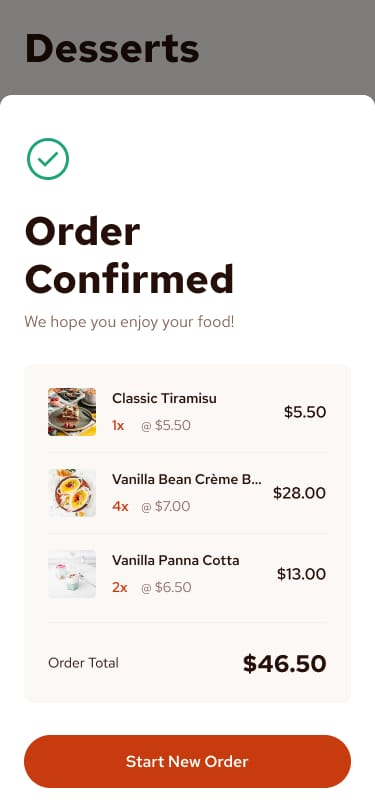

# Product List with Cart

This project is a solution to the [Frontend Mentor](https://www.frontendmentor.io) challenge "Product List with Cart". The aim of the challenge is to build a responsive product list where users can add items to a cart, adjust quantities, and see the total order price.

## Table of Contents

- [Overview](#overview)
- [Features](#features)
- [Technologies Used](#technologies-used)
- [Installation](#installation)
- [Usage](#usage)
- [Screenshots](#screenshots)
- [Project Status](#project-status)
- [Acknowledgments](#acknowledgments)
- [Contact](#contact)

## Overview

The "Product List with Cart" project provides a dynamic and responsive interface where users can browse a list of products, add items to their cart, adjust quantities, and view the total price. The interface is designed to be user-friendly and works seamlessly across various screen sizes.

## Features

- **Responsive Design**: The layout adapts to different screen sizes, ensuring a great user experience on both mobile and desktop devices.
- **Product List**: Displays a list of products with images, names, categories, and prices.
- **Add to Cart**: Users can add items to their cart with a single click.
- **Quantity Adjustment**: Users can increase or decrease the quantity of items in their cart.
- **Remove Items**: Users can remove items from their cart.
- **Total Price Calculation**: The total order price is calculated dynamically based on the items in the cart.
- **Confirmation Modal**: A modal popup confirms the order when the "Confirm Order" button is clicked.

## Technologies Used

- **React**: JavaScript library for building user interfaces.
- **Tailwind CSS**: Utility-first CSS framework for rapid UI development.
- **FontAwesome**: Icon library used for cart icons.

## Installation

To get a local copy up and running, follow these simple steps:

1. Clone the repository:
   ```bash
   git clone https://github.com/gery-guedegbe/product-list-with-cart.git
   ```
2. Navigate to the project directory:
   ```bash
   cd product-list-with-cart
   ```
3. Install dependencies:
   ```bash
   npm install
   ```
4. Start the development server:
   ```bash
   npm start
   ```

## Usage

1. Open your browser and go to `http://localhost:3000`.
2. Browse the list of products.
3. Click "Add to Cart" to add items to your cart.
4. Adjust quantities or remove items as needed.
5. Click "Confirm Order" to see the order confirmation modal.

## Screenshots


_Product list showing various items_


_Cart with selected items and total price_

## Project Status

This project is currently complete, but improvements and additional features are always welcome. Feel free to fork the repository and submit pull requests.

## Acknowledgments

- Thanks to [Frontend Mentor](https://www.frontendmentor.io) for providing the challenge and resources.
- Icons by [FontAwesome](https://fontawesome.com).

## Contact

Géry Guedegbe - [guedegbe2003@gmail.com](mailto:guedegbe2003@gmail.com)

Project Link: [Github Link](https://github.com/gery-guedegbe/Frontent-Mentor-Challenge---product-list-with-cart.git)
